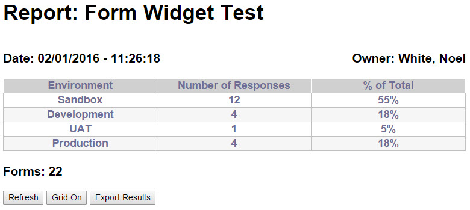
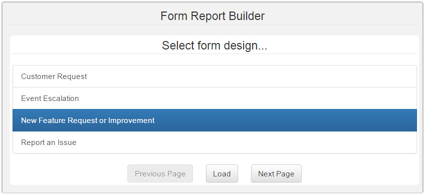
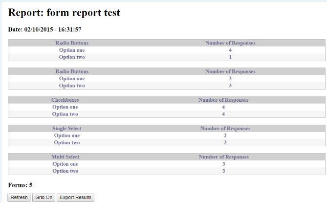

Jive - Form Report Widget
=========================
<p></p>
The Form Report widget helps create content within Jive with consistent output format and controlled inputs.  This is a [Jive](https://community.jivesoftware.com/welcome) HTML widget project that creates a builder application allowing users to drag & drop [Bootstrap](http://getbootstrap.com/) elements to create a form design.  The widget works with Jive content types, enables categorizing and tagging, and allows attachments to be included.  Form designs can be saved and reloaded later to modify the form.  Each submitted form creates a unique document with a table of the form fields with the user’s entered information.  This makes it easy to guide users what to submit as well as making the submissions much easier to process.
      
Prerequisite
------------
The [Content Lookup](https://github.com/fmr-llc/jive-content-lookup) widget installation has essential parts of setting up this widget project.  Make sure to install the Content Lookup widget prior to continuing with the Form installation.

The [Form](https://github.com/fmr-llc/jive-form) widget is required to create form designs for the Form Report to load.  You should have the Form Report Widget installed and a form design created to test your Form Report.

Upload Form Libraries
---------------------
* Download and extract the form report widget zip archive to your local computer if you have not done so already.
* Log into your Jive community.
* Navigate to the upload location for your library files.
* Create an Uploaded File in the Library location of your Jive community.  Drag the file "form_report_widget.css" to the file section of the upload.  Set the file name to "Form Report Widget CSS Library", put a description of your choosing, tag it, set the authors, and make sure it is being published to the correct Library location.  Click Publish.
* Create another Uploaded File in the Library location of your Jive community.  Drag the file "form_report_widget.js" to the file section of the upload.  Set the file name to "Form Report Widget JavaScript Library", put a description of your choosing, tag it, set the authors, and make sure it is being published to the correct Library location.  Click Publish.
* Create an Uploaded File in the Library location of your Jive community.  Drag the file "form_report_widget_builder.css" to the file section of the upload.  Set the file name to "Form Report Widget Builder CSS Library", put a description of your choosing, tag it, set the authors, and make sure it is being published to the correct Library location.  Click Publish.
* Create another Uploaded File in the Library location of your Jive community.  Drag the file "form_report_widget_builder.js" to the file section of the upload.  Set the file name to "Form Report Widget Builder JavaScript Library", put a description of your choosing, tag it, set the authors, and make sure it is being published to the correct Library location.  Click Publish.

Update Library Loader
---------------------
* Use the Content Lookup widget to search for "Library Loader".  Click the link to the file in the results.  If it is not found, contact your administrator.
* Download a copy of the "Library Loader" file from your community.  Open it for editing.
* Go back to the Content Lookup widget and search for "Form Report Widget".  You should see the four library files you uploaded to your community above.
* Find the search result for "Form Report Widget CSS Library" and copy its Content ID.  It should be a number like 694225.
* Update the library_loader.js file line for "form_report_widget.css" and update the content ID variable (it should be 0 before updating) to the Content ID you just copied.  The result should look similar to:
```
	libraries['form_report_widget.css'] = { contentID: '694225' };
```
* Find the search result for "Form Report Widget JavaScript Library" and copy its Content ID.  It should be a number like 694226.
* Update the library_loader.js file line for "form_report_widget.js" and update the content ID variable (it should be 0 before updating) to the Content ID you just copied.  The result should look similar to:
```
	libraries['form_report_widget.js'] = { contentID: '694226' };
```
* Find the search result for "Form Report Widget Builder CSS Library" and copy its Content ID.  It should be a number like 694227.
* Update the library_loader.js file line for "form_report_widget_builder.css" and update the content ID variable (it should be 0 before updating) to the Content ID you just copied.  The result should look similar to:
```
	libraries['form_report_widget_builder.css'] = { contentID: '694227' };
```
* Find the search result for "Form Report Widget Builder JavaScript Library" and copy its Content ID.  It should be a number like 694228.
* Update the library_loader.js file line for "form_report_widget_bulder.js" and update the content ID variable (it should be 0 before updating) to the Content ID you just copied.  The result should look similar to:
```
	libraries['form_report_widget_builder.js'] = { contentID: '694228' };
```
* Save the changes to the library_loader.js file on your computer.
* Edit the "Library Loader" uploaded file in your Jive community.
* Drag the updated file from your computer to the file section of the uploaded file.  Click Publish.

You have now updated the Library Loader in your Jive community with the library files needed to run the Form Report Widget.

Install the Form Report Widget Builder application
--------------------------------------------------
* Use the Content Lookup widget to search for "jQuery Library".  Copy the Content ID.  It should be a number like "694224"
* Look in the Form Report Widget archive on your computer and edit the "form_report_widget_builder.html" file.
* Find the jquery_content_id and replace the zero in the quotes with the Content ID you just copied.  The result should look similar to:
```
	var jquery_content_id = "694224";
```
* Go back to the Content Lookup widget and get the Binary URL for "jQuery Library".  It should look similar to:
```
	https://myjiveinstance.mycompany.com/api/core/v3/attachments/file/694224/data
```
* Edit the "form_report_widget_builder.html" file again.
* Find the line:
```
    <script src='JQUERY'></script>
```
replace the text JQUERY with the URL you just copied.  It should end up looking similar to:
```
    <script src='https://myjiveinstance.mycompany.com/api/core/v3/attachments/file/694224/data'></script>
```
* Use the Content Lookup widget to search for "Library Loader".  Copy the Content ID.  It should be a number like "694223"
* Edit the "form_report_widget_builder.html" file again.
* Find the library_loader_content_id and replace the zero in the quotes with the Content ID you just copied.  The result should look similar to:
```
	var library_loader_content_id = "694223";
```
* Save the file.
* Go to the site you want to put the Form Report Builder application in your community, and go to the Overview page.
* Manage the Overview page, and drag a new HTML widget onto the page.
* Edit the new HTML Widget.
* Copy the updated code from "form_report_widget_builder.html" and paste it into the "Your HTML" entry field in the new widget.
* Click "Save Properties".
* Click "Publish Layout".

Your Form Report Builder is now set up.  Site admins can use the below instructions to create their own Form Reports...

Build the Form Report
---------------------
* The starting screen displays a list of form designs you have access.
  <p></p>
  Select the desired form design, and click Load.  The builder will verify that at least one tag has been configured on the form, or display an error if none exist.
* The code for the form report will be generated.  Copy the code.
* Go to the overview page you want to put the form report.
* Drag an HTML Widget into a column.  Medium or Wide columns work best, based on the complexity of the report.
* Edit the widget and paste the form report code.
* Click Save Properties.
* Publish the page.
You should have a form report that displays the fields in the form design that are able to be tallied.

Usage
-----
Once the Form Report is set up on a page, the report will automatically generate when the page loads.
<p></p>
A table is created for each field in the form design that can be tallied.  These include submitters, person selectors, radio buttons, checkboxes, single selects, multi-selects, and selectable categories.  One row is created per option.  Each form read in also has an export row created in a hidden section in case a full export of the form submissions is desired (see the Export results button below).

The widget utilizes the Jive API to load in the form documents associated with the form design.  It uses the destination location, form name, and tag(s) configured in the form design to look up the reports.  The report will be updated with the results as they are processed.  The percentages will not be calculated until all of the form submissins are processed.

There are three buttons at the bottom of the report:
* Refresh - This erases the report data and reads the form submissions again to refresh the report.
* Grid On/Off - This button turns on/off a thicker grid between the cells.  This can help to read complex reports.
* Export results - As form submissions are loaded in, an export record is built for each.  Clicking the Export results button will display a new section with the export records, and all of the records will be selected.  Simply copy the data to your clipboard.  If you accidentally click in the form and unselect the export, you can press the button to hide it, then show it again and they will be re-selected.  The copied export can be pasted into a spread sheet (such as Excel) for post-processing.  Simply go to the first cell and paste the export you copied.  All of the formatting should carry over into the spread sheet.  You can now post process the report information.

Issues
------
If your widget is not working as expected, please review the [Issues](docs/issues.md)

Additional Jive-n widget projects in this series
------------------------------------------------
* [Accordion widget](https://github.com/fmr-llc/jive-accordion)
* [Content Lookup](https://github.com/fmr-llc/jive-content-lookup)
* [Content Viewer widget](https://github.com/fmr-llc/jive-content-viewer)
* [Export widget](https://github.com/fmr-llc/jive-export-followers)
* [Form widget](https://github.com/fmr-llc/jive-form)
* [Menu Bar widget](https://github.com/fmr-llc/jive-menu)
* [Picture Carousel widget](https://github.com/fmr-llc/jive-picture-carousel)
* [Presentation widget](https://github.com/fmr-llc/jive-presentation)
* [Search widget](https://github.com/fmr-llc/jive-advanced-search)
* [Team Listing widget](https://www.github.com/fmr-llc/jive-team-listing)

Contributing
------------
If you would like to contribute to this project, please check out [Contributing](docs/contributing.md)

License
-------
(c) 2015-2016 Fidelity Investments
Licensed under the [Apache License](docs/LICENSE), Version 2.0